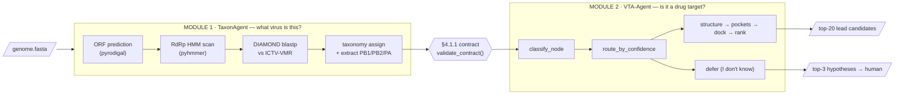
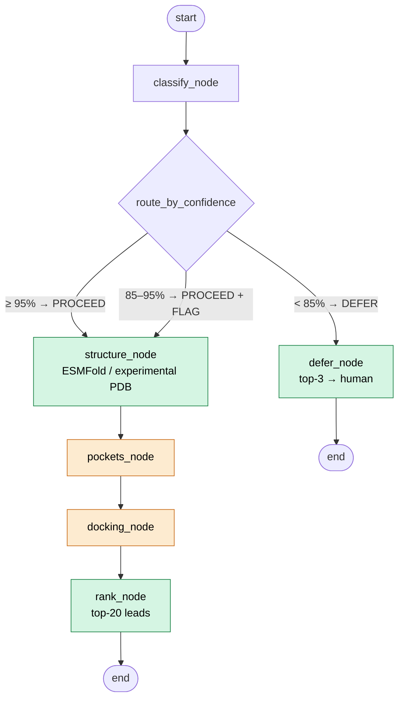
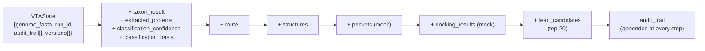

# VTA-Agent Architecture — How TaxonAgent and VTA-Agent Work Together

> **One-line model:** TaxonAgent answers *"what virus is this?"*; VTA-Agent answers
> *"is it a druggable target, and which compounds look promising?"* They are two
> separate modules joined by a single validated contract — not one monolith.

This document explains the system at three zoom levels: the two-module picture,
the internals of each module, and the shared state that flows through the graph.

---

## 0. Why two modules?

The most common way pipelines like this die is **integration hell**: three
beautifully-built components that won't talk to each other. We avoid it by drawing
exactly one seam between classification (Module 1) and target assessment
(Module 2), and freezing the data that crosses it as a validated JSON contract.

- **Module 1 — TaxonAgent** (`taxonagent/`): a standalone, already-built viral
  genome classifier. Has its own test suite, CI, and release version. VTA-Agent
  *imports* it; it never reimplements classification.
- **Module 2 — VTA-Agent** (`vta-agent/`): the orchestrator + structural/docking
  layer. A LangGraph state machine that consumes the contract and drives folding,
  pocket detection, docking, and ranking.

Because the seam is a typed contract validated at the boundary, either side can be
developed, tested, and swapped independently. That is the whole architectural bet.

---

## 1. The big picture — two modules, one contract

```
     ┌──────────────────────────────────────┐       ┌────────────────────────────────────────────┐
     │   MODULE 1 — TaxonAgent              │       │   MODULE 2 — VTA-Agent                       │
     │   "What virus is this?"             │       │   "Is it a drug target?"                     │
     │   repo: taxonagent/                 │       │   repo: vta-agent/  (imports Module 1)       │
     └──────────────────────────────────────┘       └────────────────────────────────────────────┘
                   │                                                    │
 genome.fasta ────▶│   classify_genome(fasta)                          │
                   │                                                    │
                   │          ┌──────────  THE CONTRACT SEAM  ────────┐ │
                   └─────────▶│   §4.1.1 dict   (validate_contract)   │─┘
                              │   • genus / species                   │
                              │   • confidence_pct + confidence_basis │
                              │   • extracted_proteins {PB1,PB2,PA}   │
                              │   • ictv_rule_match, versions, …      │
                              └───────────────────────────────────────┘
                                              │
                                              ▼   consumed by VTA-Agent's graph
```

**Explanation.** `classify_genome` (an alias of `taxonagent.classify`) is the
*only* function VTA-Agent imports from Module 1. It returns one dict. VTA-Agent
immediately calls `validate_contract()` on it, so a malformed or drifted result
fails **loudly at the seam** rather than silently three nodes downstream. Neither
module reaches into the other's internals — the dict is the entire interface.

---

## 2. The contract — what actually crosses the seam

`taxonagent.classify()` emits this flat dict (the "§4.1.1" contract). It is
validated against `taxonagent.VTA_CONTRACT_SCHEMA` — the single source of truth,
so the consumer never hand-rolls a second schema that could drift.

```
{
  "strain_id":          "amnoonviridae_1",
  "genus":              "Tilapinevirus",
  "species":            "Tilapia lake virus",
  "confidence_pct":     87.3,
  "confidence_basis":   "best-hit amino-acid identity (DIAMOND blastp) … "
                        "— an identity band, NOT a calibrated probability",
  "ictv_rule_match":    [ … ICTV demarcation rules applied … ],
  "extracted_proteins": {
      "PB1": {"sequence": "M…", "length_aa": 560, "plddt": null, "method": "rdrp_hmm_hit"},
      "PB2": {"sequence": "K…", "length_aa": 450, "plddt": null, "method": "size_rank"},
      "PA":  {"sequence": "L…", "length_aa": 340, "plddt": null, "method": "size_rank"}
  },
  "reference_alignment": { … },
  "audit_trail":        [ … ordered decisions … ],
  "timestamp":          "2026-06-22T…Z",
  "taxonagent_version": "0.1.0",
  "kg_version":         "ICTV-VMR-MSL40"
}
```

**Two fields deserve special attention:**

- **`confidence_pct` + `confidence_basis` (read these together).** The percentage
  is an **amino-acid identity band** — how similar the query is to its nearest
  known relative — *not* a calibrated probability of correctness. `confidence_basis`
  states this in words. The router (§4) must threshold the number *knowing what it
  means*; presenting "87.3%" as calibrated confidence would be dishonest.

- **`extracted_proteins`.** The foldable protein targets for Module 2. Each carries
  a `plddt` slot (initially `null`) that the structure node fills after folding.
  For TiLV/Amnoonviridae these are the orthomyxo-like polymerase subunits
  **PB1 / PB2 / PA** (segments 1–3), confirmed by the RdRp HMM hit landing in class
  **Insthoviricetes**. (The earlier draft contract mistakenly named bunyavirus
  Gn/Gc — corrected here.)

---

## 3. Inside TaxonAgent (Module 1) — sequence → taxonomy

```
  genome.fasta
      │
      ▼
  ┌─────────────────┐   ┌──────────────────┐   ┌─────────────────────┐   ┌──────────────────┐
  │ ORF prediction  │──▶│ RdRp HMM scan    │──▶│ DIAMOND blastp      │──▶│ Taxonomy assign  │
  │ (pyrodigal)     │   │ (pyhmmer)        │   │ vs ICTV-VMR DB      │   │ genus / species  │
  └─────────────────┘   └──────────────────┘   └─────────────────────┘   └──────────────────┘
       proteins           "is it a virus,         best-hit % identity        + confidence_pct
                           which lineage?"         → confidence band          + extract PB1/PB2/PA
                                                                                     │
                                                                                     ▼
                                                                          §4.1.1 contract dict
```

**Explanation (left → right):**

1. **ORF prediction (pyrodigal).** Finds open reading frames and translates them to
   candidate proteins — you can't classify or fold a protein you haven't located.
2. **RdRp HMM scan (pyhmmer).** Scans those proteins against RdRp profiles. For a
   virus this both confirms "yes, viral" and pins the lineage. For TiLV the best hit
   is the *Insthoviricetes* RdRp profile — the orthomyxo-like signal that tells us
   the targets are PB1/PB2/PA.
3. **DIAMOND blastp vs the ICTV-VMR database.** Best-hit amino-acid identity to the
   nearest known virus → this is where `confidence_pct` comes from (hence: an
   identity band).
4. **Taxonomy assignment + protein extraction.** Resolves genus/species, applies ICTV
   demarcation rules, and extracts the foldable subunits into `extracted_proteins`.

The output is the contract dict from §2.

---

## 4. Inside VTA-Agent (Module 2) — the LangGraph state machine

```
                          ┌───────────────┐
   contract dict  ───────▶│ classify_node │  reads §4.1.1, validate_contract(), fills VTAState
                          └──────┬────────┘
                                 ▼
                       ╔════════════════════╗     route_by_confidence(confidence_pct)
                       ║ route_by_confidence ║ ───────────────────────────────────────┐
                       ╚═════════╤══════════╝                                          │
                ≥95 PROCEED  /    │   \  <85 DEFER                                      │
            85–95 FLAG ──────┘    │    └───────────────────────────┐                   │
                                  ▼                                ▼                   │
                       ┌──────────────────┐               ┌──────────────┐            │
                       │ structure_node   │  REAL         │ defer_node   │ "I don't   │
                       │ ESMFold / exp PDB │               │ → top-3 to   │  know" →END│
                       └────────┬─────────┘               │   a human    │            │
                                ▼                          └──────┬───────┘            │
                       ┌──────────────────┐                       │                    │
                       │ pockets_node     │  MOCK (FPocket-shaped)│                    │
                       └────────┬─────────┘                       │                    │
                                ▼                                 │                    │
                       ┌──────────────────┐                       │                    │
                       │ docking_node     │  MOCK (Vina-shaped)   │                    │
                       └────────┬─────────┘                       │                    │
                                ▼                                 │                    │
                       ┌──────────────────┐                       │                    │
                       │ rank_node        │  REAL logic           │                    │
                       │ → top-20 leads   │                       │                    │
                       └────────┬─────────┘                       │                    │
                                ▼                                 ▼                    ▼
                               END  ◀──────────────────────────  END  ──────────  audit_trail
```

**Legend:** **REAL** = built/working code · **MOCK** = returns *real-shaped* fake
data now, swapped for the real tool in Phase 2.

**Explanation (node by node):**

- **`classify_node`** — calls `classify_genome`, validates, and copies the needed
  fields into the shared state (including `classification_basis`).
- **`route_by_confidence` (+ `route_edge`)** — the reliability heart of the system.
  Implemented as a real **node** that records the decision plus a **pure edge** that
  reads it. (LangGraph discards state mutations made inside a conditional-edge
  function, so the decision must be written in a node to persist — the node/edge
  split is deliberate, not incidental.) The decision:
  - `confidence_pct ≥ 95` → **PROCEED** to folding
  - `85 ≤ confidence_pct < 95` → **PROCEED but FLAG** for review
  - `confidence_pct < 85` → **DEFER**: stop and hand the top-3 hypotheses to a human

  Thresholds come from the Integration Strategy doc. Crucially the router reads
  `classification_basis` so its audit line says *"87.3% aa identity → FLAG"*, not a
  misleading *"87.3% confidence."* This is the mechanism that lets the system say
  **"I don't know"** instead of confidently guessing on ambiguous input.
- **`structure_node`** (REAL) — folds each extracted protein. **Experimental-first:**
  if a solved cryo-EM structure exists (TiLV PB1/PB2/PA have PDB entries), use it;
  otherwise fold with ESMFold and compute **mean pLDDT** (per-residue confidence).
  Experimental structures carry `mean_plddt = None` meaning *trusted ground truth*,
  not "missing."
- **`pockets_node`** (MOCK) — returns FPocket-shaped pocket records (druggability,
  volume, center). Mocked now; real FPocket in Phase 2.
- **`docking_node`** (MOCK) — returns AutoDock-Vina-shaped records
  (`ligand, pocket, dG, rmsd, le`). Mocked now; real Vina + ligand prep in Phase 2.
- **`rank_node`** (REAL) — the scientific-judgment step, built for real now: a
  weighted composite score over docking ΔG, RMSD, ligand efficiency, and pocket
  conservation → top-20 lead candidates.
- **`defer_node`** — the honest exit when confidence is too low to proceed.

**Why mock the biology but build the logic?** Folding and docking are the slow,
fragile, expensive steps — but their *output shapes* are trivial to fake
convincingly. By building the ranking, routing, and reporting against real-shaped
fakes now, the Phase 2 swap-in of real FPocket/Vina is invisible to everything
downstream. *Mock the expensive; prove the contracts.*

---

## 5. The shared state — one object, growing as it flows

Every node reads from and writes to one typed object, `vta.state.VTAState`. No node
talks to another except through this state — that is what makes the graph
composable and the run auditable.

```
  VTAState  (every node reads & writes THIS, nothing else)
  ─────────────────────────────────────────────────────────────────────────────
  classify_node  ▶  + taxon_result, extracted_proteins,
                     classification_confidence, classification_basis, versions
  router         ▶  + route ("proceed" | "flag" | "defer")
  structure_node ▶  + structures {PB1: {pdb_path, mean_plddt}}
  pockets_node   ▶  + pockets    {PB1: [{druggability, …}]}          (mock)
  docking_node   ▶  + docking_results [{ligand, dG, rmsd, …}]        (mock)
  rank_node      ▶  + lead_candidates (top-20)
  every node     ▶  + audit_trail[...]   ← the running, ordered decision log
```

The **`audit_trail`** is the auditability thesis made concrete. After a run you can
read every decision in order, e.g.:

```
TaxonAgent: Tilapinevirus / Tilapia lake virus @ 87.3% (KG ICTV-VMR-MSL40)
Router: 87.3% aa identity in [85,95) -> PROCEED w/ FLAG
Structure[PB1]: using EXPERIMENTAL 8PSO
Structure[PB2]: ESMFold, mean pLDDT 84.1
[MOCK] Pockets[PB1]: 3 found, top druggability 0.82
[MOCK] Docking: 900 ligand-pocket pairs
Ranking: top lead remdesivir score 0.91 (dG -8.4, conservation 0.91)
```

---

## 6. Phase 1 vs Phase 2 — what's real, what's mocked

| Step               | Phase 1 (now)                          | Phase 2 (swap-in)                              |
|--------------------|----------------------------------------|------------------------------------------------|
| Classification     | **REAL** — TaxonAgent                   | unchanged                                      |
| Contract + schema  | **REAL** — validated at the seam        | unchanged                                      |
| Confidence router  | **REAL** — 3-way, basis-aware           | unchanged                                      |
| Structure folding  | **REAL** — ESMFold + experimental PDB   | + low-pLDDT handling, chain extraction         |
| Pocket detection   | **MOCK** — FPocket-shaped               | real FPocket (validate vs known TiLV site)     |
| Docking            | **MOCK** — Vina-shaped                  | real AutoDock Vina + RDKit/Meeko + ChEMBL      |
| Ranking            | **REAL** — composite score              | unchanged                                      |
| State / audit      | **REAL**                                | unchanged                                      |

The payoff: the contract, router, ranking logic, state object, and audit trail are
all built for real in Phase 1, so **Phase 2 is pure module-swapping, not
architecture work.**

---

## 7. Build status (this implementation)

| Artifact                          | File                          | Status        |
|-----------------------------------|-------------------------------|---------------|
| Shared state contract (`VTAState`)| `vta/state.py`                | ✅ built + verified |
| Classify node                     | `vta/nodes/classify.py`       | ✅ built + verified |
| Confidence router (node + edge)   | `vta/nodes/router.py`         | ✅ built + verified |
| Stub nodes (structure / defer)    | `vta/nodes/stubs.py`          | ✅ built + verified |
| Mock pockets (FPocket-shaped)     | `vta/nodes/pockets.py`        | ✅ built + verified |
| Mock docking (Vina-shaped)        | `vta/nodes/docking.py`        | ✅ built + verified |
| Ranking (REAL composite logic)    | `vta/nodes/rank.py`           | ✅ built + verified |
| Real structure node (Task 2.1)    | `vta/nodes/structure.py`      | ✅ experimental-first + chain extraction + ceiling refusal |
| Compiled graph (full Phase-1 chain)| `vta/graph.py`               | ✅ runs end-to-end → top-20 |
| Acceptance + unit tests           | `tests/test_*.py`             | ✅ 11 passed |

On the Module 1 side, the contract surface — `classify` / `classify_genome` /
`validate_contract` / `VTA_CONTRACT_SCHEMA` — is exported from the `taxonagent`
package root and covered by tests (suite: 259 passed, 2 skipped).

---

### Risk status

1. **ESMFold API ceiling — CONFIRMED & HANDLED.** Probed `api.esmatlas.com`: 200 aa
   → 200 OK; 400 aa → 504 timeout; 500 aa → **413 "Sequence is longer than 400."**
   So a hard 400-residue ceiling. PB1 (~500) / PB2 (~450) exceed it. The structure
   node refuses >400 aa honestly (logs "needs local ESMFold/chunking") instead of
   crashing. **Phase 2 must add local GPU ESMFold or chunking** to fold PB2 and any
   large novel protein.
2. **Experimental PDB chain extraction — FIXED.** Confirmed from 8PSO COMPND:
   chain A = PA-like, chain B = "putative PB1" (515 res), chain C = RdRp. The node
   extracts the named chain (verified live: PB1→515 CA, PA→316 CA), not the whole
   complex.
3. **`mean_plddt = None` semantics — DOCUMENTED.** Experimental structures carry
   `mean_plddt = None` meaning *trusted ground truth*. Phase 2's "refuse low-confidence
   structures" must treat `None` as trusted, not missing/low. (Asserted in tests.)
4. **Float-keyed ranking normaliser — FIXED.** `rank_node` computes each criterion's
   min/max once and normalises inline; no dict keyed by float value.

### New finding — PB2 has no labelled experimental chain

The 8PSO/8PT2 depositions label three protein chains (PA-like / putative-PB1 / RdRp)
but **none explicitly "PB2."** So the contract's `PB1/PB2/PA` naming maps cleanly to
experimental structures for **PA (chain A)** and **PB1 (chain B)** only; **PB2 has no
confident experimental chain** and currently falls to the (refused) ESMFold path.
This is a genuine taxonomy-vs-structure naming gap to resolve with the TiLV
structural biology before Phase 2 docks PB2.

---

## Appendix A — Mermaid diagrams (GitHub / IDE-rendered)

The ASCII diagrams above render anywhere (terminals, plain text). These Mermaid
versions render as real flowcharts on GitHub, GitLab, and most IDEs.

### A.1 The two modules and the contract seam



### A.2 The VTA-Agent LangGraph state machine



> Green = real, working code · Orange = real-shaped mock, swapped in Phase 2.

### A.3 The shared state growing through the run


