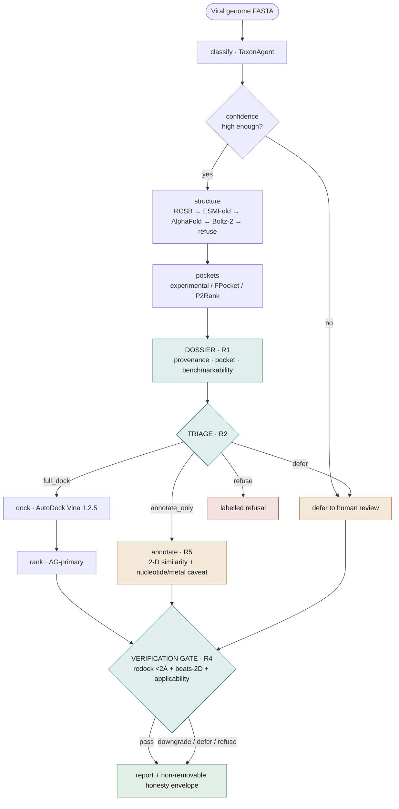
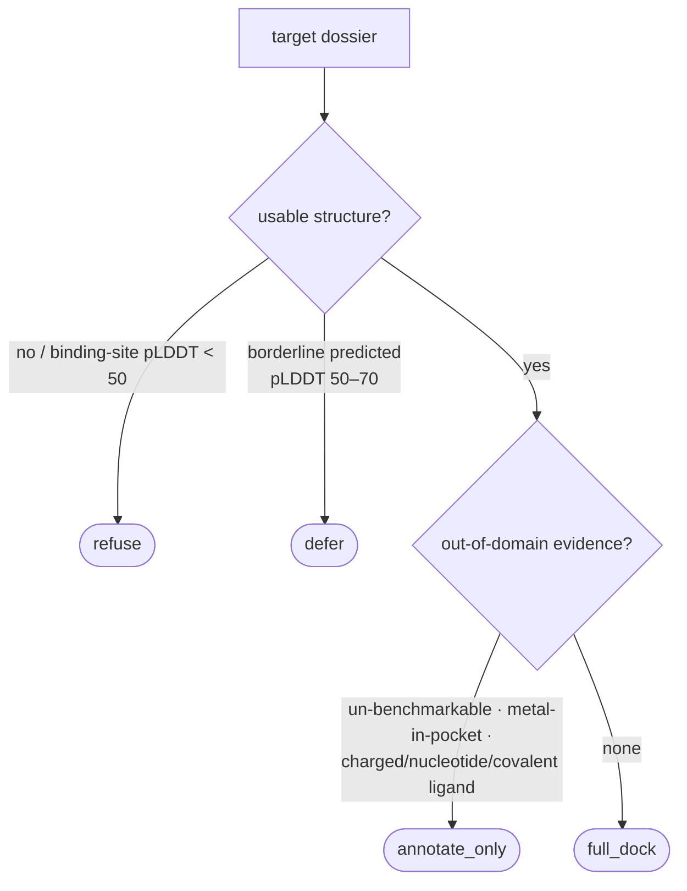
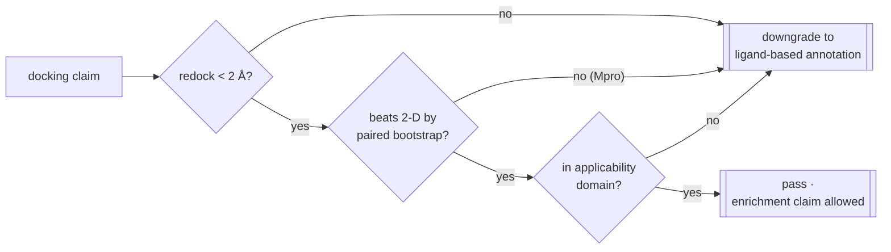
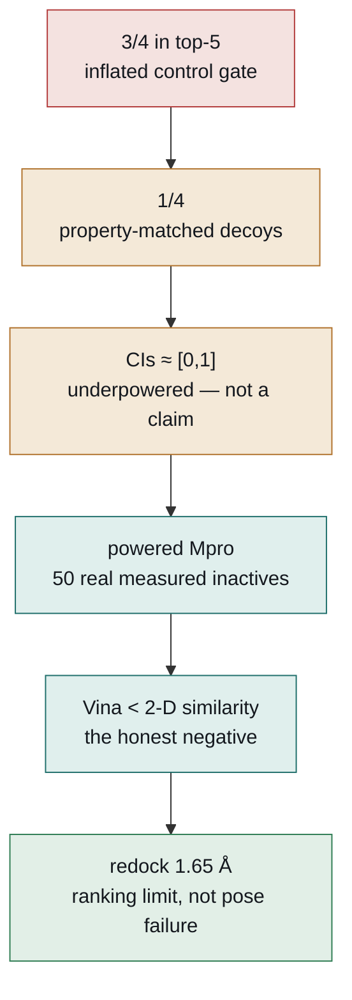
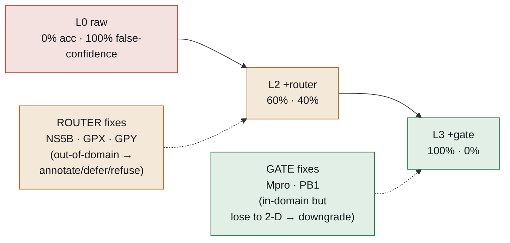

# VTA-Agent — Complete Project Document

*An autonomous, leakage-aware structure-based antiviral virtual-screening agent whose validation
is built to deflate its own inflation.*

Every number in this document is drawn from committed artifacts in the repository. Where a result
is negative, underpowered, or un-benchmarkable, it is stated as such — that honesty is the point
of the project, not a caveat to it.

---

## 0. One-paragraph summary

VTA-Agent takes a viral genome, classifies it, picks protein targets, decides whether structure-
based docking is even appropriate for each target, screens antiviral compounds where it is, and
emits **ranked, uncertainty-bearing hypotheses** wrapped in a non-removable "honesty envelope."
Its central, measured finding is uncomfortable and honest: **on the one powered benchmark, and
even on a purpose-built fair-arena test, AutoDock Vina does not beat a trivial 2-D chemical-
similarity baseline** — and a learned rescorer trained in-house fails the same way. A component
ablation shows that the agent's value is not the docking but the **workflow** — routing each
target to the right method and gating every claim behind physics + statistics. The whole system
is reproducible (284 hermetic tests) and self-auditing by construction.

---

## 1. The problem

Structure-based virtual screening (SBVS) is unusually easy to fool yourself with:

- **Inflated control panels** — a handful of known actives in a tiny library "recover" well.
- **Leaky decoys** — decoy sets separable by trivial 2-D/physicochemical features, so a method
  looks skilful while only re-learning chemistry it was handed (Wallach & Heifets 2018; Chen
  2019; Sieg 2019).
- **Size-biased scores** — docking affinity correlates with molecular size, not just binding.
- **Invalid significance** — comparing two overlapping confidence intervals is not a significance
  test (Schenker & Gentleman 2001; Cumming 2009).

VTA-Agent's design principle is to **assume its own result is inflated until a harder test says
otherwise**, and to make every enrichment claim survive the checks a skeptical reviewer would
apply *before* the claim is made.

---

## 2. Workflow / architecture

One typed state object (`vta/state.py`) flows through a LangGraph pipeline
(`vta/graph.py`). Real tools are used when present; a missing tool produces a **labelled fallback
with provenance**, never a silent fake or a crash.

### 2.1 The pipeline (fast path)

```
classify → route → structure → structure_qc → target_prioritization → proteinttt → pockets
  → conservation → species_resolution → DOSSIER → TRIAGE → dock → conservation_contacts
  → rescore → boltzina → consensus → rank → chemistry → selectivity → resistance → admet
  → ANNOTATE → VERIFICATION GATE → report
```

Opt-in slow phases append after `admet`: MD validation (`md_select → md_simulate → md_analyze →
md_rerank`) and FEP/ABFE.

| Stage | What it does |
|---|---|
| **classify / route** | TaxonAgent classifies the genome; below a confidence threshold the run **defers to a human** rather than guessing. |
| **structure** | Experimental-first cascade: RCSB → ESMFold → AlphaFold DB → Boltz-2 → **labelled refusal** if none resolve. |
| **pockets** | Experimental active site / FPocket / P2Rank consensus. |
| **DOSSIER (R1)** | Assembles a typed target dossier: structure provenance/quality, pocket descriptors (incl. metal-in-pocket), target class, metal dependence, **benchmarkability** (from the frozen benchmark). |
| **TRIAGE (R2)** | Routes each target to `full_dock \| annotate_only \| defer \| refuse`. Changes *which* method runs, never the docking weights. |
| **dock** | AutoDock Vina 1.2.5 (Meeko 0.7.1 receptor prep, OpenBabel fallback). Skipped, labelled, for targets the router routed away from docking. |
| **rank** | ΔG-primary; ligand efficiency and conservation are reported annotations (weight 0). |
| **ANNOTATE (R5)** | For `annotate_only` targets: a labelled 2-D-similarity annotation with the nucleotide/metal caveat — never a docking ΔG claim. |
| **VERIFICATION GATE (R4)** | Hard gate on the single edge into reporting: redock RMSD < 2 Å + docking-beats-2D paired test + applicability domain. A docking-enrichment claim stands only on `pass`; otherwise `downgrade / defer / refuse`. |
| **report** | Self-contained HTML report + full audit trail, wrapped in the honesty envelope. |

### 2.2 The four routing decisions

- **`full_dock`** — experimental/adequate pocket + in-domain (drug-like) ligands + benchmarkable → dock and rank. *(e.g. SARS-CoV-2 Mpro)*
- **`annotate_only`** — scoring out-of-domain: un-benchmarkable class, metal in the pocket, or a charged/nucleotide/covalent ligand class → labelled ligand-based annotation. *(e.g. HCV NS5B triphosphate)*
- **`defer`** — borderline predicted structure / intermediate binding-site confidence → human review.
- **`refuse`** — no usable structure (low binding-site pLDDT) → labelled refusal.

The router downgrades **only on positive, run-available evidence**, so a drug-like screen against
a metal-dependent polymerase still docks (this keeps the demonstration screens working while
correctly routing the genuinely out-of-domain nucleotide class away from docking).

### 2.3 The workflow, graphically

**End-to-end pipeline** — one state object, real tools when present, honest fallbacks otherwise.
The three shaded nodes are the Phase-R reasoning layer; the gate is the last edge before any report.



**Triage decision (R2)** — the router downgrades only on positive, run-available evidence:



**Verification gate (R4)** — a docking-enrichment claim is emitted only if it clears all three
gates. *On Mpro, gate 2 fails (docking does not beat 2-D) → the claim is downgraded, honestly.*



---

## 3. Data sources

| Source | Use | Status |
|---|---|---|
| **COVID Moonshot** (Boby 2023) | SARS-CoV-2 Mpro measured actives **and measured inactives** | primary Mpro benchmark |
| **ChEMBL** `CHEMBL4523582` (Mpro), `CHEMBL4296320` (HCV NS5B NI) | actives + property-matched decoys | integrated |
| **RCSB PDB** | experimental structures (7L11 Mpro, 2XI3 HCV NS5B, 8PSO TiLV PB1) | integrated |
| **AlphaFold DB / ESMFold / Boltz-2** | predicted structures (fallback cascade) | seamed |
| **ADMET-AI** | drug-likeness / toxicity annotation | annotation-only |

Every external call goes through an injectable network seam with a committed cache or a labelled
fallback, so the test suite is fully offline and no run fabricates data.

---

## 4. Statistical methodology

- **Confidence intervals on every metric** — bootstrap (≥ 1,000, up to 10,000 resamples); never a
  bare point estimate.
- **Paired-bootstrap difference test**, never CI-overlap — all CI-overlap significance logic was
  purged from the codebase.
- **Holm–Bonferroni** correction across the metric family (BEDROC α=20, EF1%, logAUC, ROC-AUC).
- **Trivial baselines on the identical split** — ECFP4 2-D similarity (leave-one-out) + a random
  null. A structure-based method has demonstrated skill only if it beats these.
- **Binding modes never pooled** — covalent vs non-covalent, nucleotide- vs non-nucleotide-
  inhibitor — enforced and unit-tested.

---

## 5. The validation journey (the heart of the project)

The project is a **ladder of progressively harder tests, each of which removed optimism** — and
the pipeline reported each one against itself.

### 5.1 The deflation ladder

```
3/4 in top-5 (inflated control gate)
  → 1/4 (property-matched decoys)
  → CIs ≈ [0,1] (underpowered — not a claim)
  → powered Mpro (50 real measured inactives)
  → Vina < 2-D similarity (the honest negative)
  → redock 1.65 Å (a ranking limit, not a pose-search failure)
```



*Each rung applied a harder test that lowered the apparent performance — and the pipeline
reported it against itself.*

### 5.2 Three validation targets (frozen artifact `outputs/phase9/locked_benchmark.json`, hash `fdac0664fe0cea8f`)

| Target | Control set | BEDROC (95% CI) | Grade |
|---|---|---|---|
| **SARS-CoV-2 Mpro** (protease, non-covalent) | 50 experimentally-measured Moonshot inactives (real, not presumed decoys) | 0.68 [0.36, 0.89] | **powered** (informative CIs; docking modest) |
| **TiLV PB1** (RdRp) | ChEMBL property-matched decoys (4 actives) | 0.41 [~0.00, 1.00] | **underpowered demonstration** |
| **HCV NS5B NI** (triphosphate) | matched-decoy recipe fails (24/43 actives recover 0 decoys; 3.09/active) | — | **un-benchmarkable** (nucleotide meta-finding) |

Two protein classes (protease + polymerase) give a real generalization test.

### 5.3 The headline honest finding — docking does not beat 2-D similarity

On the powered Mpro benchmark (non-covalent actives vs real measured inactives):

| Method | BEDROC(α20) | ROC-AUC |
|---|---|---|
| Random | 0.50 | 0.50 |
| **2-D similarity (ECFP4, leave-one-out)** | **0.92** | **0.76** |
| AutoDock Vina | 0.68 | 0.58 |

Paired bootstrap Δ(Vina − 2-D), BEDROC: **95% CI [−0.57, +0.06]** — structure-based enrichment
**not demonstrated** (Wallach & Heifets 2018). At a non-degenerate **31:1** ratio (24 actives ×
745 real measured inactives) the loss becomes **significant**: paired Δ BEDROC **−0.24 [−0.44,
−0.04], P = 0.01**; ROC-AUC **−0.18 [−0.31, −0.07], P = 0.001**; **Vina EF1% = 0.0**.

### 5.4 Diagnostics — it is a real ranking limit, not a broken protocol

- **Redocking (WI-2):** Vina reproduces the native Mpro ligand pose to **1.65 Å (< 2.0 Å)** on the
  exact benchmark structure — the slide-5.3 result is a ranking/benchmark limit, not a pose-search
  failure. (HCV NS5B triphosphate RMSD uncomputed — an honest RDKit/phosphate tooling gap.)
- **Parent-vs-active-form (9D):** triphosphate vs parent docking ΔG differ by only **−0.10
  kcal/mol** (with curated 2XI3 Mg²⁺) — poor nucleotide recovery is a genuine scoring limit, not a
  "wrong species docked" artifact.
- **Ensemble docking (Phase 10):** a 3-conformer ensemble vs single structure is **not
  significant** by the paired test.

### 5.5 The nucleotide-antiviral meta-finding (a first-class result)

Nucleotide antivirals (remdesivir, sofosbuvir…) act as **charged triphosphates** with no property-
matched decoy twins. The purchasable-library, scaffold-distinct, property-matched decoy recipe
**cannot build a decoy set** for them (24/43 HCV NS5B actives recover 0 decoys). The property-
**unmatched** recipe builds one trivially but the benchmark is then **meaningless** — 2-D
similarity scores a perfect ROC-AUC 1.0 because charged triphosphates are trivially separable from
neutral drug-like decoys by fingerprint alone. **Matched-decoy validation of the nucleotide class
fails from both directions.** Corollary warning to the field: pipelines that appear to "validate"
nucleotide antivirals are usually docking the parent prodrug, not the active species.

---

## 6. The honesty envelope (Deployment gate D0 / G1: PASS)

Every report carries a **non-removable** envelope, rendered structurally on every run (a deferred
or empty run still carries it), built from committed artifacts only:

- **Disclaimer** — ranked, uncertainty-bearing HYPOTHESES, not clinical/efficacy/safety claims.
- **Pinned benchmark** — artifact + `frozen_at` + `content_hash` (`fdac0664fe0cea8f`) + gate
  decision (`DO NOT PROMOTE (annotation-only)`).
- **Trivial-baseline verdict** — per target, whether docking beats 2-D by a paired test (Mpro:
  "does NOT beat").
- **Pose reliability** — redock RMSD per target.
- **Out-of-validated-domain flag** for any target no frozen benchmark covers.
- **Scoring caveats** — the nucleotide/metal and modest-signal caveats.

The live ranking weights are imported from the ranker, so the envelope can never drift from what
actually ranked. Two "stale-honesty defects" were fixed where the report previously *misdescribed
its own ranking* (claiming ligand-efficiency-led ranking / conservation as a "10% term" after the
gate had made ranking ΔG-primary).

---

## 7. Phase R — the reasoning architecture (HemaGuide-inspired)

The Phase-11 finding (docking doesn't beat 2-D) reframes the contribution as the **workflow**, not
the scorer — mirroring HemaGuide (Nature Medicine 2026), whose measured lesson was that
**autonomous routing to the right method per case** is the integrating element. VTA-Agent
implements the analogue and, crucially, **proves it by ablation**.

### 7.1 R6 component ablation — the money result (`outputs/phaseR/ablation.json`)

Held-out targets spanning classes, scored on **decision-level correctness** (the emitted claim vs
a curated ground-truth disposition), not enrichment:

| Level | decision accuracy | false-confidence rate |
|---|---|---|
| L0 — raw (rigid Vina + rank) | **0%** | **100%** |
| L1 — +dossier | 0% | 100% |
| L2 — +triage (router) | 60% | 40% |
| L3 — +verification (gate) | **100%** | **0%** |
| L4 — full agent | 100% | 0% |

**Routing-type-dependence** — the router and the gate fix **disjoint** target sets:



The **router** fixes NS5B, GPX, GPY (out-of-domain → annotate/refuse/defer at L2); the
**verification gate** fixes MPRO, PB1 (in-domain but lose to 2-D → downgrade at L3) —
**neither alone is sufficient.** Run-to-run
consistency 1.0. This is the evidence that *the integrating architecture, not the docking scorer,
is the contribution* — exactly HemaGuide's "no single component sufficient across case types."

*(GPX/GPY are synthetic low-binding-site-pLDDT structures used to exercise the refuse/defer routes.)*

---

## 8. Phase S — the fair-arena test and the rescorer

### 8.1 Activity cliffs (`outputs/phaseS/activity_cliffs.json`)

Docking losing to 2-D on the analog-clustered Moonshot set is *expected* — the fair test is
**activity cliffs**: pairs near-identical in 2-D but with a large potency gap, where similarity
reasoning is weakest and structure-based skill *can* show. 345 compounds were docked to lift the
pool from 17 → **1,193 cliff pairs (powered)**.

| Method | cliff-ranking accuracy (median [95% CI]); chance = 0.50 |
|---|---|
| **AutoDock Vina (−ΔG)** | **0.418 [0.391, 0.447]** — significantly **below** chance |
| 2-D-kNN QSAR | **0.666 [0.639, 0.692]** — significantly above chance |
| **RF-Score (learned)** | **0.392 [0.365, 0.420]** — significantly **below** chance |

Vina is **anti-correlated with potency on cliffs** (ranks the less-potent analog stronger ~58% of
the time — most likely Vina's size bias). A 17-pair pilot had shown the opposite (Vina 0.65); a
small-sample fluke that powering the benchmark **reversed**, vindicating the decision to power it.

### 8.2 The learned rescorer — GNINA blocked, RF-Score built in-house

The literature's strongest lever is a learned rescorer. Every off-the-shelf option is
**un-installable on this arm64 macOS box**:

| Tool | Blocker |
|---|---|
| **GNINA** | 10 GB amd64 Docker image + unreliable Docker Hub CDN (4+ failed pulls); no native arm64 binary |
| **RTMScore** | needs `dgl` — no working arm64 / torch-2.12 wheel |
| **ODDT / RF-Score** | needs OpenBabel-2.x `OBElementTable`, removed in OpenBabel 3.x |

So **RF-Score's own method** (Ballester & Mitchell 2010) was rebuilt on the working stack
(`vta/eval/rfscore.py`): 36 protein–ligand contact-count features → RandomForest with
**scaffold-clustered leave-out CV** (no analog leakage), scored out-of-fold on the same 1,193
cliff pairs (1,109 poses, 425 scaffold groups). Result above: **RF-Score also fails on cliffs**
(0.39, indistinguishable from raw Vina; paired RF−Vina −0.03). A learned rescorer does not rescue
docking here.

**Honest scope:** RF-Score is *target-specific* (Moonshot-trained, out-of-fold) and *coarse*; it
does not prove a PDBbind-pretrained GNINA CNN would also fail — that transfer question is deferred
to a native Linux/GPU box, where `scripts/phaseS_rescore_gnina.py` (ready, batched) can run it.

---

## 9. Deployment

### 9.1 Open WebUI integration — chat with the agent (built, tested)

An **OpenAI-compatible adapter** (`vta/service/`) lets Open WebUI (or any OpenAI client) drive the
agent as a chat "model" — no fork of Open WebUI needed.

- `GET /v1/models`, `POST /v1/chat/completions` (streaming + non-streaming), `GET /health`;
  optional `VTA_API_KEY`. Launch: `python -m vta.service`.
- A chat turn runs the **real, offline reasoning layer** (dossier → triage → build_envelope),
  grounded in the committed benchmarks: routing decision + benchmark grade/CI + the "docking loses
  to 2-D" verdict + the non-removable disclaimer. No docking, no network → a turn can't hang. A raw
  genome/FASTA is politely deferred (that needs the full folding + docking pipeline).
- Docs: `docs/openwebui_integration.md`. Tests: `tests/test_openai_adapter.py`.

### 9.2 Vercel deploy scaffold (prepared, verified self-contained)

`api/index.py` (ASGI entry, anchors path + bundled benchmark data), `vercel.json` (routes +
`includeFiles: outputs/**`), `api/requirements.txt` (fastapi + pydantic only — the function pulls
in *no* rdkit/numpy/langgraph, so it fits Vercel's size limit and cold-starts fast). Deploy needs
the user's Vercel login.

### 9.3 Deferred production track

The full production service (queue-backed workers, Postgres run store, containers, governance —
plan D1–D10) is **deliberately deferred** behind the G1 scientific-readiness gate. The chat serves
honest triage, not a full docking run.

---

## 10. Engineering discipline

- **284 hermetic tests** (`taxonagent/venv/bin/python -m pytest -q`) — every external call is
  monkeypatched at an injectable seam; the suite is fully offline.
- **Honest degradation** — missing tool/data → labelled skip with provenance, surfaced in the
  report; never a fabricated or zero-filled value.
- **Tool self-discovery** — binaries (Vina, FPocket, GNINA) resolve via `vta/toolconfig.py`.
- **Reproducibility by construction** — every step records tool versions + an audit trail; the
  benchmark is a frozen, hash-stamped artifact.
- **No ranking-weight or rescorer change outside the paired-test gate**; the weights in force are
  always the validated ones, logged per run.

---

## 11. Headline results at a glance

| Question | Answer (committed data) |
|---|---|
| Does docking beat a trivial 2-D baseline on the powered Mpro benchmark? | **No** — BEDROC 0.68 vs 0.92; at 31:1, paired Δ −0.24, P = 0.01, EF1% = 0.0 |
| Does docking work on activity cliffs (the fair arena)? | **No** — Vina 0.42, below chance (1,193 pairs) |
| Does a learned rescorer rescue it? | **No** — in-house RF-Score 0.39, below chance, ≈ raw Vina |
| Are Vina's *poses* the problem? | **No** — redocks to 1.65 Å (pose-reliable); it is a ranking limit |
| Can nucleotide antivirals be benchmarked with matched decoys? | **No** — fails from both directions (meta-finding) |
| What *is* demonstrated to work? | **The workflow** — routing + verification drive false-confidence 100% → 0% (R6 ablation) |
| Is it reproducible? | **Yes** — 284 hermetic tests; frozen, hash-stamped benchmark |

---

## 12. Honest scope & limitations

- Outputs are ranked, **uncertainty-bearing hypotheses** — never clinical, efficacy, or safety
  claims. This framing is structurally non-removable from every output.
- **No wet-lab validation.** Prospective IC50/EC50 on locked predictions is a parallel, evidence-
  gated track, not yet done.
- **No fabricated data** — missing SMILES / decoys / metal coordinates / assay values become a
  labelled skip with provenance.
- The powered signal is **Mpro only**; TiLV is underpowered (4 actives) and the nucleotide class
  is un-benchmarkable — none are presented as powered wins.
- The R6 ground-truth dispositions are **curated (5 targets)** — a mechanism demonstration, not a
  population estimate.
- The GNINA *transfer* question (a PDBbind-pretrained CNN on cliffs) is **open**, deferred to a
  native-GPU environment.

---

## 13. Repository map

| Path | Contents |
|---|---|
| `vta/graph.py`, `vta/state.py` | pipeline wiring + the shared typed state |
| `vta/nodes/` | every node: classify, router, structure, pockets, **dossier, triage, verification, annotate_rank**, dock, rank, report, MD/FEP … |
| `vta/report_envelope.py` | the non-removable honesty envelope |
| `vta/eval/` | metrics, baselines, significance (paired bootstrap), decoys, **cliffs**, **rfscore** |
| `vta/service/` | OpenAI-compatible adapter (Open WebUI integration) |
| `vta/data/`, `docs/databases.md` | data-source registry (honest INTEGRATED/PLANNED/CATALOGUED flags) |
| `outputs/phase9/locked_benchmark.json` | frozen, hash-stamped benchmark |
| `outputs/phaseR/`, `outputs/phaseS/` | ablation + activity-cliff + RF-Score results and gates |
| `api/`, `vercel.json` | Vercel deploy scaffold |
| `docs/` | `MASTER_DOCUMENT.md`, `openwebui_integration.md`, `figures/vta_figure_set.html`, gate artifacts |
| `tests/` | 284 hermetic tests |

---

## 14. How to run

```bash
# tests (offline, hermetic)
PYTHONPATH=.:../taxonagent/src ../taxonagent/venv/bin/python -m pytest -q          # 284 pass

# regenerate a benchmark result
PYTHONPATH=.:../taxonagent/src ../taxonagent/venv/bin/python -m scripts.phaseR_ablation
PYTHONPATH=.:../taxonagent/src ../taxonagent/venv/bin/python -m scripts.phaseS_activity_cliffs

# chat with the agent (Open WebUI adapter)
PYTHONPATH=.:../taxonagent/src ../taxonagent/venv/bin/python -m vta.service              # :8000/v1
# then point Open WebUI at http://localhost:8000/v1, model `vta-agent-triage`
```

---

## 15. Phase index (scratch → now)

| Phase | What | Status |
|---|---|---|
| 0–8 | architecture + first evidence (the 3/4 → 1/4 deflation) | ✅ |
| 9 | powered Mpro benchmark + CIs + parent-vs-active-form (9D) + frozen artifact | ✅ |
| 10 | ensemble docking (null result, paired test) | ✅ |
| 11 | validity hardening — trivial baselines, paired bootstrap, LE→ΔG gate, redocking, GNINA-readiness; extended docks (Mpro 31:1, HCV-NI unmatched) | ✅ |
| D0 / G1 | deployment scientific-readiness gate — non-removable honesty envelope | ✅ PASS |
| R (1–3) + R6 | reasoning architecture (dossier → triage → verification) + component ablation | ✅ |
| S | activity-cliff benchmark (powered) + in-house RF-Score rescorer | ✅ |
| Integration | Open WebUI OpenAI-compatible adapter + Vercel deploy scaffold + figure set | ✅ |
| Deferred | R3 playbook corpus · production service (D1–D10) · GNINA-on-GPU transfer · wet-lab | ⏳ |

---

*The contribution is not a big number — it is a validation methodology that catches its own
optimism, and an agent that knows which method to apply and when to abstain. The negatives are the
asset.*
