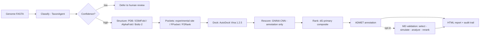
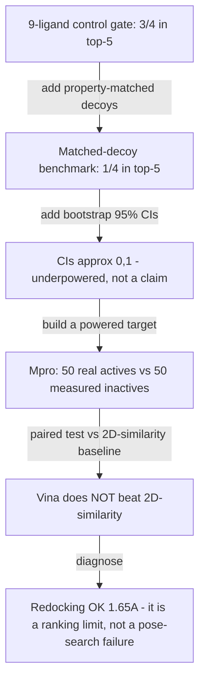

# VTA-Agent — Presentation Deck (slide-ready)

> Source document for generating a PPT (NotebookLM / Claude / PowerPoint). Each `##` is one
> slide: a title, bullets, and *Speaker notes*. Two Mermaid diagrams render in most tools;
> if yours doesn't, screenshot them from a Mermaid live editor. All numbers are from committed
> artifacts as of 2026-06-30 (Phase 11). Two extended results (Jobs A/B) are marked PENDING.

---

## 1 — Title

# VTA-Agent
### An autonomous, leakage-aware antiviral triage agent whose validation is built to deflate its own inflation

- Genome → ranked, uncertainty-bearing antiviral hypotheses
- Structure-based virtual screening, orchestrated with LangGraph
- The contribution is not a big number — it is a validation methodology that catches its own optimism

*Speaker notes: Lead with the honest framing. This is a methods platform, not a "docking finds cures" tool. The headline is rigor.*

---

## 2 — The problem it addresses

- Structure-based virtual screening is **easy to fool yourself with**: inflated control panels, leaky decoys, size-biased scores, invalid significance tests
- Most docking papers never run the checks that would deflate their own numbers
- VTA-Agent is built so that **every enrichment claim must survive the checks a skeptical reviewer would apply** — before the claim is made

*Speaker notes: The field has a reproducibility problem. Our design principle: assume our own result is inflated until a harder test says otherwise.*

---

## 3 — Pipeline workflow (what the agent does)



- Missing tool → **labelled fallback with provenance**, never a silent fake or a crash
- Every step records tool versions + an audit trail (reproducibility by construction)

*Speaker notes: One state object flows through typed nodes. Real tools when present; honest degradation when not.*

---

## 4 — The core idea: a validation ladder that deflates inflation



- **Every rung, a harder test removed optimism** — and the pipeline reported it against itself
- This ladder *is* the scientific contribution

*Speaker notes: Walk the arc top to bottom. Each arrow is a methodological upgrade that lowered the apparent performance. That is the point.*

---

## 5 — Three validation targets (every metric = median + 95% CI)

| Target | Actives | Control set | Result | Grade |
|---|---|---|---|---|
| **TiLV PB1** (RdRp) | 4 | ChEMBL property-matched decoys | BEDROC 0.41, CIs ≈ [0,1] | Underpowered demo |
| **HCV NS5B NI** (RdRp, triphosphate) | 43 | matched-decoy recipe fails (24/43 recover 0 decoys) | not benchmarkable *with that recipe* | Nucleotide meta-finding |
| **SARS-CoV-2 Mpro** (protease, non-covalent) | 50 | **50 experimentally-measured inactives** | BEDROC 0.68 [0.36, 0.89]; ROC-AUC 0.58 [0.47, 0.69] | Powered — but see slide 6 |

- Two protein classes (polymerase + protease) → a real generalization test, not one pocket twice
- Frozen, hash-stamped artifact: `outputs/phase9/locked_benchmark.json`

*Speaker notes: Mpro is the only powered one — real measured inactives from COVID Moonshot. That is what makes slide 6 credible.*

---

## 6 — The headline honest finding

### On the powered Mpro benchmark, docking does NOT beat trivial 2D-similarity

| Method | BEDROC(α20) | ROC-AUC |
|---|---|---|
| Random | 0.50 | 0.50 |
| **2D-similarity (ECFP4, leave-one-out)** | **0.92** | **0.76** |
| AutoDock Vina | 0.68 | 0.58 |

- Paired bootstrap Δ(Vina − 2D-sim), BEDROC: **CI [−0.57, +0.06]**, P(Δ>0)=0.06
- Verdict (Wallach & Heifets 2018): **structure-based enrichment NOT demonstrated**
- Reported as-is, not inflated

*Speaker notes: This is the money slide. A method that cannot beat 2D memorization has not shown structure-based skill. Most papers never run this baseline.*

---

## 7 — Why this is credible, not broken: diagnostics

- **Redocking (WI-2):** Vina reproduces the native Mpro ligand pose to **1.65 Å (< 2.0 Å)** on the exact benchmark structure → the slide-6 result is a *ranking/benchmark* limit, not a pose-search failure
- **Parent-vs-active-form (9D):** triphosphate vs parent ΔG differ by only **−0.10 kcal/mol** (sofosbuvir parent even out-scored its own triphosphate) → poor nucleotide recovery is a genuine scoring limit, not a "wrong species docked" artifact
- **Ensemble docking (Phase 10):** 3-conformer ensemble vs single-structure is **not significant** by the paired test

*Speaker notes: We can rule out the three easy excuses — bad poses, wrong protonation species, single-conformer bias. The negative is real.*

---

## 8 — Statistical rigor (what a reviewer checks first)

- **Paired bootstrap, never CI-overlap.** Two overlapping CIs can still have a reliably non-zero paired difference (Schenker & Gentleman 2001; Cumming 2009). Every CI-overlap significance decision was **purged from the codebase**.
- **Confidence intervals on every metric** (bootstrap ≥ 1000–10 000), never a bare point estimate
- **Holm–Bonferroni** correction across the metric family
- **Binding modes never pooled** (covalent vs non-covalent; NI vs NNI) — enforced and unit-tested

*Speaker notes: These are the four things that sink most docking papers in review. We do all four.*

---

## 9 — A ranking change, decided by the gate (not by hand)

- Old ranking led with **ligand efficiency (LE)**, justified by the *inflated* 9-ligand control gate
- Phase-11 gate (paired bootstrap): the LE-composite **does not beat plain ΔG** on Mpro (Δ BEDROC CI [−0.58, +0.06])
- → **LE demoted** to a reported annotation; **ΔG is now the primary ranking term** (Kenny 2019: LE is size/unit-dependent, no benchmark basis for leading)
- No ranking weight changes except through this gate, with the supporting Δ-CI logged

*Speaker notes: We let the data fire our own prior ranking scheme. That is the discipline.*

---

## 10 — The nucleotide-antiviral meta-finding (a first-class result)

- Nucleotide antivirals (remdesivir, sofosbuvir…) act as **triphosphates** — highly charged, very polar
- A purchasable-library, scaffold-distinct, **property-matched** decoy recipe **cannot build a decoy set** for them (24/43 actives recover 0 decoys; 3.09/active)
- **Corollary warning to the field:** pipelines that appear to "validate" nucleotide antivirals are usually docking the **parent prodrug**, not the active species
- Tied to the recipe — *not* claimed impossible in general (property-unmatched / generative / real-inactive-nucleotide recipes are the untested alternatives)

*Speaker notes: This is publishable on its own. It is a precise, evidence-backed statement about a whole drug class.*

---

## 11 — Extended validation IN PROGRESS (fill in when docks finish)

- **Job A — Mpro at 31:1** (24 actives × 745 real measured inactives): does "Vina < 2D-sim" survive a non-degenerate ratio, and does EF1% become informative once its ceiling lifts 2.0 → ~32? — **PENDING**
- **Job B — HCV-NI with property-UNMATCHED decoys**: does the nucleotide benchmark *run* with a different recipe — and if Vina "enriches," is it binding signal or just charge/size discrimination? — **PENDING**
- Both close a reviewer's remaining escape hatches ("degenerate ratio", "your decoy recipe"). Result reported honestly whichever way it lands.

*Speaker notes: Placeholder slide. Replace with the two result rows once the background docks complete.*

---

## 12 — What this means (the contribution)

- **Position VTA-Agent as a rigorously-validated triage + methodology platform**, not a "docking finds hits" tool
- Every enrichment number carries a CI, a paired comparison to trivial baselines, and a pose-reproduction check
- The **negatives are the asset**: two-target matched benchmarks, a nucleotide meta-finding, an honest data-leakage section, and a pipeline that deflates its own inflation
- Outputs are **ranked, uncertainty-bearing hypotheses — never clinical or efficacy claims**

*Speaker notes: The paper leads with methodology and honesty, not a hit. That is what survives review.*

---

## 13 — Roadmap

- **Phases 0–8:** architecture + first evidence (the 3/4 → 1/4 deflation) ✅
- **Phase 9:** powered benchmark + CIs + parent-vs-active-form + frozen artifact ✅
- **Phase 10:** ensemble docking (null result, paired test) ✅
- **Phase 11:** validity hardening — baselines, paired significance, LE gate, redocking, GNINA-readiness ✅ (extended docks in progress)
- **Phase 12:** production hardening (FastAPI, queue, Postgres, containers)
- **Phase 13:** reproducibility package (RO-Crate/PROV-O, Zenodo) + manuscript
- **Phase 11-wetlab (parallel, off-software):** prospective IC50/EC50 on locked predictions — turns a methods paper into a discovery paper

*Speaker notes: Software-complete through 13; wet-lab is the parallel evidence-gated track.*

---

## 14 — Responsible use & limitations

- Ranked **hypotheses**, not clinical recommendations — this framing is in every report through release
- No fabricated SMILES, decoys, metal coordinates, or assay data — missing data = labelled skip with provenance
- Dual-use awareness; per-source data license map; honest reporting of every underpowered/failed analysis
- Known limits stated plainly: modest docking signal, underpowered TiLV, triphosphate RMSD tooling gaps

*Speaker notes: Close on responsibility. The honesty is the brand.*

---

## 15 — Appendix: methods & tools

- **Engine:** AutoDock Vina 1.2.5; receptor prep Meeko 0.7.1 (Meeko-first) + **OpenBabel fallback**
- **Pockets:** experimental active site / FPocket / P2Rank consensus
- **Structure:** RCSB experimental-first → ESMFold → AlphaFold DB → Boltz-2 → labelled refusal
- **Data:** ChEMBL, COVID Moonshot (measured actives + inactives), RCSB, AlphaFold DB
- **Stats:** bootstrap CIs, paired bootstrap, Holm–Bonferroni; ECFP4 2D-similarity + random baselines
- **Key references:** Truchon & Bayly 2007 (BEDROC); Mysinger 2012, Bauer 2013 (decoys); Stein 2021 (DUDE-Z); Imrie 2021 (DeepCoy); Wallach & Heifets 2018, Sieg 2019 (baselines); Schenker & Gentleman 2001, Cumming 2009 (paired significance); Kenny 2019 (LE); McNutt 2025 (GNINA 1.3)

*Speaker notes: Reference slide for Q&A; hide in the main flow if short on time.*

---

### How to turn this into slides
- **NotebookLM:** upload this file → "Create" → generate a slide/summary; each `##` maps to a slide.
- **Claude / PowerPoint:** paste a slide block and ask for a designed layout; the *Speaker notes* become the notes pane.
- **Diagrams:** paste the two ```mermaid``` blocks into mermaid.live and export PNG/SVG for the deck.
